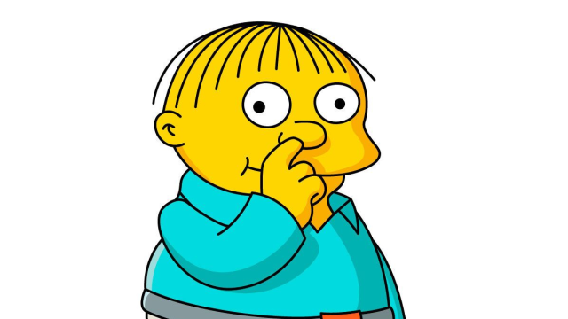
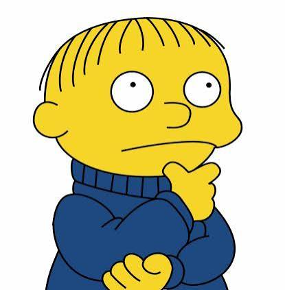
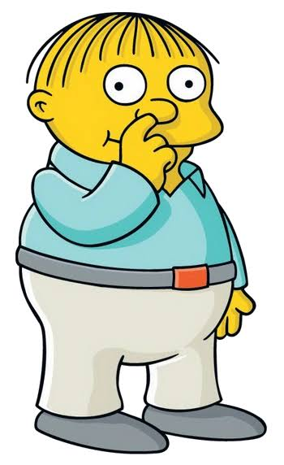
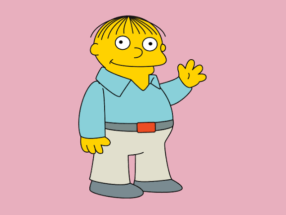
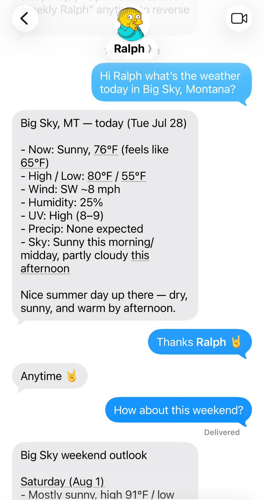

# Ralph asset collection

Reusable public media for the Ralph project lives in `images/`. The
machine-readable inventory is [`manifest.json`](manifest.json).

Existing files such as `ralph.css` and `ralph-og.png` are production website
assets. The files listed below are the reusable project collection.

## Images

| Preview | Asset | Format | Dimensions |
| --- | --- | --- | --- |
|  | [`ralph-wiggum-thinking.webp`](images/ralph-wiggum-thinking.webp) | WebP | 640 × 360 |
|  | [`ralph-excited-green-closeup.png`](images/ralph-excited-green-closeup.png) | PNG | 400 × 400 |
|  | [`ralph-thinking-blue-sweater.png`](images/ralph-thinking-blue-sweater.png) | PNG | 415 × 423 |
|  | [`ralph-thinking-full-body.png`](images/ralph-thinking-full-body.png) | PNG | 350 × 572 |
|  | [`ralph-waving-pink.png`](images/ralph-waving-pink.png) | PNG | 576 × 432 |
|  | [`ralph-imessage-weather-chat.jpg`](images/ralph-imessage-weather-chat.jpg) | JPEG | 921 × 1742 |

## Collection conventions

- Use descriptive, lowercase, hyphenated filenames.
- Keep original files unchanged; add a new filename for a revised asset.
- Add each reusable asset to `manifest.json`.
- Record provenance without assuming or granting reuse rights.
